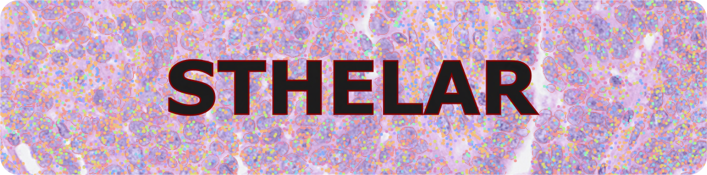
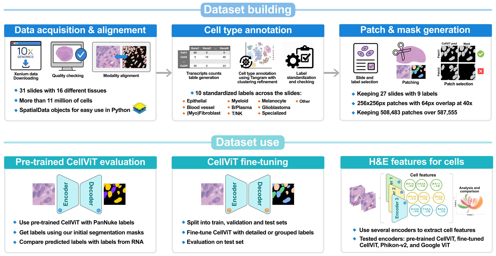

<p align="center">
  
</p>

<p align="center" style="font-size:28px;">
  <strong>STHELAR, a multi-tissue dataset linking spatial transcriptomics and histology for cell type annotation</strong>
</p>

Understanding the composition of the tumor microenvironment is critical for cancer research. Spatial transcriptomics profile gene expressions in spatial context, revealing tissue architecture and cellular heterogeneity, but its cost and technical complexity limit adoption. To address this issue, we introduce a pipeline to build STHELAR, a large-scale dataset that integrates spatial transcriptomics with Hematoxylin and Eosin (H&E) whole slide images for cell type annotation. The dataset comprises 31 human Xenium FFPE sections across 16 tissue types, for 22 cancerous and 9 non-cancerous patients. It contains over 11 million cells, each assigned to one of ten curated cell-type categories designed to accommodate a pan-cancer setting. Annotations were derived through Tangram-based alignment to single-cell reference atlases, followed by slide-specific clustering and differential expression analysis. Co-registered H&E images enabled extraction of over 500,000 patches with segmentation and classification masks. Quality control steps assessed segmentation accuracy, filtered out low-confidence regions, and verified annotation integrity. STHELAR provides a reference resource for developing models to predict cell-type annotations directly from histological images. A detailed description of the pipeline, methods, and results can be found in the following article: [link to article later].

- Data is coming from the 10x Genomics platform using the Xenium technology and only FFPE human samples. A table listing all the data can be found in `list_data.numbers` in the data folder.
- All the part about the CellViT model predictions and fine-tuning can be found in the following repository: [CellViT_for_STHELAR](https://github.com/MICS-Lab/CellViT_for_STHELAR).
- Final dataset is available at: [link to data later]

## Overview

<p>
  
</p>


## Code pipeline

This section describe the code pipeline to get and analyze the data.  
(Reminder: All the part about the CellViT model predictions and fine-tuning can be found in the following repository: [CellViT_for_STHELAR](https://github.com/MICS-Lab/CellViT_for_STHELAR).)

### 1. Get sdata

- `check_resolution_HE.ipynb`: Check that all the slides are 40x resolution for level 0.
- `process_slide.py`: Build a SpatialData object for each slide containing nuclei segmentation, RNA count for each nucleus, and aligned H&E.

### 2. Annotations

- `2-1_ref_cell_types.ipynb`: Anlyze different references that can be used for cell type annotation using Tangram.
- `2-2_add_tangram_ref_annots.py`: Add Tangram cell type annotation for each nucleus for each slide.
- `2-3_refine_tangram_annots`: For each slide, refine the Tangram annotations using Leiden clustering for each slide.
- `2-4_add_cells.py`: Add cell segmentation and RNA count for each cell for each SpatialData object.
- `2-5_annots_cells`: For each slide, compute the cell type annotation using Leiden clustering (it is using cell boundary and not nucleus boundary).
- `2-6_scvi_latent_space`: For each slide, train an scVI model on RNA count table for cells and compare embeddings with previous RNA clustering.
- `2-7_add_annots`: Add all information in the SpatialData objects and do some checkings.
- `2-8_nuclei_add_annots.ipynb` and `2-9_cells_add_annots.ipynb`: Standardize nucleus and cells annotations accross slides.
- `2-10_combined_labels`: Perform MFA on RNA count from cytoplasm and nucleus, annotate, and then compare annotations with those coming from nucleus table or cell table.

### 3. Check alignment 

- `3-1_build_patches.py`: Build patches in the same format as PanNuke dataset and with the same dimension (no cell type information) to check only the segmentation quality.
- `3-2_group_npz.py`: Utility file for slide that have been processed in several times through the pre-trained CellViT model.
- `3-3_add_align.py`: For each slide, add the metrics to compare pre-trained CellViT mask prediction and Xenium-based mask for each H&E patch.
- `3-4_analyze_align.ipynb`: For each slide, analyze the pre-trained CellViT mask predictions with the Xenium-based masks.

### 4. WSI features

- `4-1_extract_cells_features.py`: Compute cell embeddings using Phikon-v2 model or a ViT based model from Google.
- `4-2_adata_features.py`: Save H&E cell features in .h5ad format for each model (Pre-trained CellViT, Phikon-v2 model, and the ViT based model from Google).
- `4-3_analyze_features_kmeans`: Perform kmeans on H&E cell features and compare clusters with previous RNA clustering. Add features to the SpatialData object for each slide.
- `4-4_extract_pannuke_labels.py`: Get PanNuke labels predicted by the pre-trained CellViT model using Xenium-based segmentation masks.
- `4-5_add_pannuke_labels.py`: Add PanNuke labels in the SpatialData object for each slide.
- `4-6_analyze_pannuke_labels.ipynb`: Compare PanNuke labels with labels derived from RNA information.

### 5. Build final dataset

- `5-1_napari_viz_path.ipynb`: Use Napari to check labels by a pathologist.
- `5-2_decide_trainning_cat.ipynb`: Choose slides and final labels to physically build H&E patches with corresponding masks for segmentation and cell type classification. Masks are build in the same format as the PanNuke dataset.
- `5-3_get_ds_per_slide_CAT.py`: Build H&E patches and masks for each selected slide.
- `5-4_group_npz`: Get a unique npz per slide.
- `shortcut_build_dataset`: To have directly the dataset in the 'CellViT' format, avoiding to compute first the dataset in the 'PanNuke' format. Different resolution for the H&E images (20x or 40x) can be also used.

### 6. Analyze trained model

Perform the same analysis as before but this time for the fine-tuned models:
(Analysis is done at the whole slide level, mixing train, validation and test sets)
- `segmentation`: Check segmentation prediction.
- `HEfeatures`: Compare H&E cell features with RNA clustering.
- `labels`: Compare predicted labels with labels from RNA information.
See help in `instructions.txt` for the steps to get the analysis.


## Data description

This section describe data available at: [link to data]  
The cell id and the patch id are kept consistent across all data.

### A SpatialData object for each slide in .zarr format

In the **'sdata_slides'** folder, a SpatialData object named **'sdata_slide-id.zarr.zip'** is provided for each slide with all the information and analyses. The SpatialData format can be manipulated using all the tools in the Scverse ecosystem, making it easy and convenient to use. This SpatialData object includes the following components:  
*Example for slide heart_s0:*   
```
SpatialData object, with associated Zarr store: sdata_final/sdata_heart_s0.zarr
├── Images
│     ├── 'he': DataTree[cyx] (3, 10645, 24544), (3, 5323, 12272), (3, 2662, 6136), (3, 1331, 3068), (3, 666, 1534), (3, 333, 767)
│     └── 'morpho': DataTree[cyx] (1, 34050, 14326), (1, 17025, 7163), (1, 8512, 3581), (1, 4256, 1790), (1, 2128, 895)
├── Points
│     └── 'st': DataFrame with shape: (<Delayed>, 10) (3D points)
├── Shapes
│     ├── 'cell_boundaries': GeoDataFrame shape: (26366, 1) (2D shapes)
│     ├── 'he_patches': GeoDataFrame shape: (7168, 7) (2D shapes)
│     └── 'nucleus_boundaries': GeoDataFrame shape: (26366, 1) (2D shapes)
└── Tables
      ├── 'features_cellvit': AnnData (26363, 1280)
      ├── 'features_phikonv2': AnnData (26363, 1024)
      ├── 'features_vit_google': AnnData (26363, 768)
      ├── 'table_cells': AnnData (26366, 377)
      ├── 'table_combined': AnnData (26366, 563)
      ├── 'table_nuclei': AnnData (26366, 541)
      └── 'table_scvi': AnnData (26366, 377)
with coordinate systems:
    ▸ '_13531419104_intrinsic', with elements:
        he_patches (Shapes)
    ▸ '_st_intrinsic', with elements:
        st (Points)
    ▸ 'global', with elements:
        he (Images), morpho (Images), st (Points), cell_boundaries (Shapes), he_patches (Shapes), nucleus_boundaries (Shapes)
```
- **'he' image**: H&E slide at several levels (with level 0 corresponding to 40x resolution and level 1 corresponding to 20x resolution), aligned with ST using the Xenium software from 10x Genomics.
- **'morpho' image**: DAPI image at several levels showing each nucleus.
- **'st' points**: Transcripts location on the slide.
- **'cell_boundaries' shapes**: Polygons for cell boundaries with corresponding cell id.
- **'nucleus_boundaries' shapes**: Polygons for nucleus boundaries with same corresponding cell id.
- **'he_patches' shapes**: Coordinates for H&E patches of size 256 px with 64 x overlap at 40x resolution, with metrics (Dice coefficient, Jaccard index, and Panoptic Quality) that compares the given mask with pre-trained CellViT prediction.
- **'table_cells' table**: Table that gives the RNA count for each cell, along with preprocessing layer, cell type annotation, cell id, and clustering.
- **'table_nuclei' table**: Table that gives the RNA count for each nucleus, along with preprocessing layer, cell type annotation, cell id, clustering, and PanNuke label.
- **'table_combined' table**: Table for MFA analysis with RNA count for cytoplasm and for nucleus, along with clustering analysis and cell type annotations.
- **'features_cellvit' table**: Table that gives the nucleus embeddings for each cell using the pre-trained CellViT model as encoder.
- **'features_phikonv2' table**: Table that gives the cell embeddings for each cell using the Phikon-v2 model as encoder.
- **'features_vit_google' table**: Table that gives the cell embeddings for each cell using the ViT based model from Google as encoder.
- **'table_scvi' table**: Table that gives the scVI embeddings for each cell, using scVI model specifically trained for each slide.

### H&E patches with corresponding segmentation and classification masks

In the **'data_40x/data'** folder, we provide:
- **'images.zip'**: H&E patches for all the slides together, using slide-id_patch-id identification.
- **'masks_slides'** folder: Contains a **'masks_slide-id.npz'** file for each slide containing segmentation and cell type classification masks, formatted identically to those in PanNuke.
- **'annot_dicts_ct_1'** folder: Contains the **'label2cat.json'** dictionary which maps the final cell labels in sdata to categories in the classification masks, the **'cat2color.json'** dictionary which maps each category in the masks to a plotting color for visual inspection, and the **'cat2idx.json'** dictionary which maps each category to its corresponding index position within the mask.
- **'masks_cell_ids_nuclei.zip'**: Segmentation masks for all the slides together, assigning to each pixel the cell ID corresponding to its nucleus.
- **'pretrained_CellViT_mask_preds'** folder: Contains a **'instance_map_predictions_slide-id.h5'** file for each slide with the predicted segmentation for each patch using the pre-trained CellViT model.

### Data for CellViT fine-tuning

For the global dataset, the following element can be found in the **'data_40x/data'** folder:
- **'cell_count.csv'**: Table summarizing, for each patch_id across all slides, the nucleus count per cell type. It follows the same format as the cell_count.csv file provided by the CellViT authors.
- **'labels.zip'**: Segmentation and classification masks for all slides. Unlike the previous masks.npz files, this format follows the CellViT convention, which separates the original mask into an instance mask and a cell type mask.
- **'patch_metrics.csv'**: Table presenting the evaluation metrics for each mask, using Dice coefficient, Jaccard index, and Panoptic Quality, and comparing with the predicted masks from the pre-trained CellViT model.
- **'types.csv'**: Table giving the tissue type for each patch.

Two fine-tuning have been done with detailed or grouped cell type classes. We provide for each fine-tuning in **'data_40x/finetuning_CellViT_detailed'** or **'data_40x/finetuning_CellViT_grouped'** folders:
- **'cell_count_train.csv'**, **'cell_count_valid.csv'**, and **'cell_count_test.csv'**: Split versions of the cell_count file indicating which patch belongs to the train, validation, or test sets.
- **'dataset_config.yaml'** and **'weight_config.yaml'**: Configuration files required for fine-tuning CellViT.

### CellViT fine-tuning outputs

In each fine-tuning directory (**'data_40x/finetuning_CellViT_detailed'** or **'data_40x/finetuning_CellViT_grouped'**), the subfolder **'output'** contains all results from the fine-tuning and evaluation processes:
- **'config.yaml'**: Configuration file used for CellViT fine-tuning.
- **'logs.log.1–5'**: Log files for fine-tuning.
- **'checkpoint_n.pth'**: Checkpoint for the best model with n the corresponding epoch number.
- **'inference_results.json'**: File containing inference results on the test set.
- **'inference.log'**: Log file for inference.

### Analysis of the fine-tuned CellViT models

For each fine-tuning, the resulting model was applied to all slides. Results can be found in the **'data_40x/finetuning_CellViT_detailed/finetuned_model_analysis'** or **'data_40x/finetuning_CellViT_grouped/finetuned_model_analysis'** folders, that contain a subfolder for each slide id with the following files:
- **'config.yaml'**: Configuration from the fine-tuning.
- **'inference_results.json'**: Prediction results.
- **'inference.log'**: Log file for inference.
- **'inference_instance_map_predictions.h5'**: Predicted segmentation mask for each patch for all the slides.
- **'cell_features_cellvit.npy'**: Nucleus embeddings for each cell using the given fine-tuned CellViT model as encoder.
- **'pixel_class_gt_mask.pth'**: The pixel count for each cell type category for each nucleus using Xenium based segmentation mask instead of the predicted one.

### Additionnal data

All analyses were conducted on H&E patches at 40x resolution. However, 'images.zip', 'labels.zip', 'masks_cell_i-ds_nuclei.zip', 'instance_map_predictions_all_slides.h5' (segmentation prediction using pre-trained CellViT), 'patch_metrics.csv', 'cell_count.csv', and 'types.csv' are also provided at 20x resolution in **'data_20x/data'** folder for research purposes.